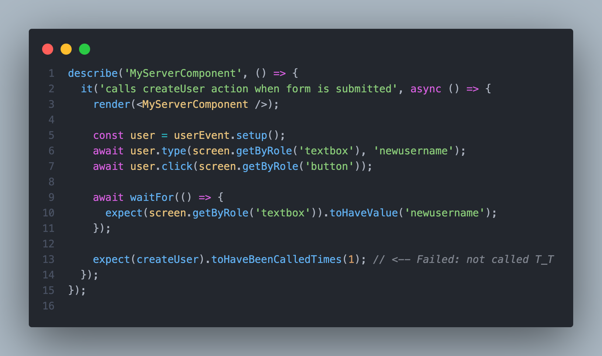

This is an example of how to write a unit test for verifying server actions in Next.js using Jest.

NOTE: The test fails because server actions are not called when the form is submitted during testing. However, the application appears to be functioning properly.



## Getting Started

Expected all tests to fail
```bash
npm run test
```
